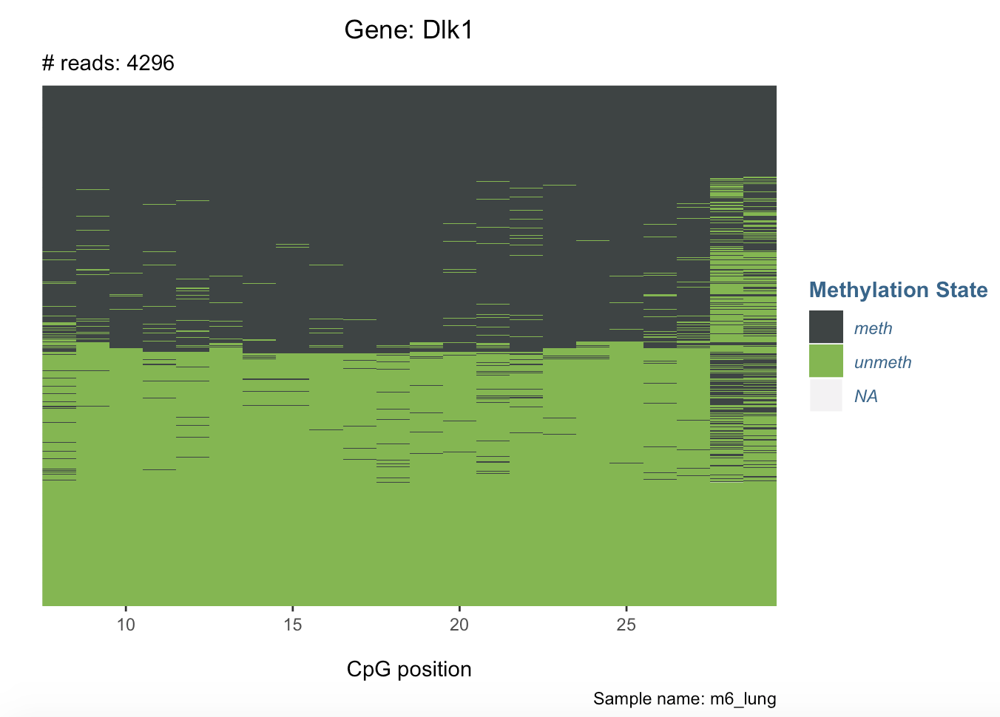

# IMPLICON - bisulfite amplicon data for imprinted loci

This is a processing guide for IMPLICON data, with detailed intructions of how to get from raw data to methylation consistancy plots at imprinted loci. 

Pre-print at [bioRxiv](https://www.biorxiv.org/content/10.1101/2020.03.21.000042v1): **IMPLICON: an ultra-deep sequencing method to uncover DNA methylation at imprinted regions**


Last update: 20/05/2020

### Table of Contents
* [Quick Start](#quick-start)
* [Detailed Processing Guide](#detailed-data-processing-guide)
  1. [UMI-handling](#step-i-umi-handling)
  2. [Adapter-/Quality Trimming](#step-ii-adapter-quality-trimming)
  3. [Genome Alignments](#step-iii-genome-alignments)
    - [Allele-specific alignments (optional)](#allele-specific-alignments)
  4. [UMI-aware deduplication](#step-iv-umi-aware-deduplication)
  5. [Allele-specific sorting (optional)](#step-v-allele-specific-sorting) 
  6. [Methylation extraction](#step-vi-methylation-extraction)
* [Read-level methylation consistency analysis](#read-level-methylation-consistency)
  1. [Filtering Implicon CpG context](#filtering-cpg-context-files)
  2. [Plotting read-level methylation consistency](#plotting-read-level-methylation-consistency)

## QUICK START

The following commands are designed to work with a hypothetical example paired-end IMPLICON dataset consisting of reads from a C57BL/6 mouse:

**Read 1:** `test_R1.fastq.gz`
**Read 2:** `test_R2.fastq.gz`

**Step I: UMI-handling**

```
trim_galore --paired --implicon *fastq.gz
```

**Step II: Adapter-/quality trimming**

```
trim_galore --paired *UMI*fastq.gz
```

**Step III: Genome alignments**

```
bismark --genome /Genomes/Mouse/GRCm38/ -1 test_8bp_UMI_R1_val_1.fq.gz -2 test_8bp_UMI_R2_val_2.fq.gz
```
\* for allele-specific alignments see [below](step-iii-genome-alignments)

**Step IV: UMI-aware deduplication**

```
deduplicate_bismark --barcode test_8bp_UMI_R1_val_1_bismark_bt2_pe.bam
```


**Step V: Allele-specific sorting**

\* for allele-specific sorting please see [below](step-v-allele-specific-sorting)


**Step VI: Methylation extraction**

```
bismark_methylation_extractor --bedGraph --gzip test_8bp_UMI_R1_val_1_bismark_bt2_pe.deduplicated.bam
```


## DETAILED DATA PROCESSING GUIDE

### Step I: UMI handling

At its 5’ end, Read 2 carries 8 bp of randomised nucleotides that serve as unique molecular identifiers (UMI) for the amplification reaction. The UMI sequence needs to be transferred from the start of Read 2 to the readID of both reads to allow UMI-aware deduplication later, a step that can be accomplished using the Trim Galore with the option --implicon (for more information type trim_galore --help). In this step, the UMI of Read 2 is added to the readID of both reads as the last element separated by a “:”, e.g.:

@HWI-D00436:407:CCAETANXX:1:1101:4105:1905 1:N:0: CGATGTTT:**CAATTTTG**

To run this specialised UMI-transfer trimming on all files of a MiSeq run you can run this command:

```
trim_galore --paired --implicon *fastq.gz
```


The FastQC per base sequence content plot would look something like this:

 	 
**Raw FastQ file:**


**UMI trimmed file:**


As an example, we are using the following set of test files to demonstrate subsequent steps that need to be taken:
 
**Input files:**
```
test_R1.fastq.gz
test_R2.fastq.gz
```

**Output files:**
```
test_8bp_UMI_R1.fastq.gz
test_8bp_UMI_R2.fastq.gz
```

### Step II: Adapter-/quality trimming

Following UMI-handling, UMI-treated IMPLICON reads require adapter and quality trimming. A standard Trim Galore run should identify and remove read-through adapter contamination as well as poor quality base calls, like so:

```
trim_galore --paired *UMI*fastq.gz
```

**Output files:**
```
test_8bp_UMI_R1_val_1.fq.gz
test_8bp_UMI_R2_val_2.fq.gz
```

### Step III: Genome alignments

Alignments to the mouse or human genome can then be obtained with a standard Bismark paired-end run, e.g.:

```
bismark --genome /Genomes/Mouse/GRCm38/ -1 test_8bp_UMI_R1_val_1.fq.gz -2 test_8bp_UMI_R2_val_2.fq.gz
```

#### Allele-specific alignments

> **Note for allele-specific mouse hybrid data**, 
the alignments need to be carried out against a genome that has SNPs between the parental strains masked out with Ns (N-masking). To prepare such a genome, please follow the instructions over at the [SNPsplit project](https://github.com/FelixKrueger/SNPsplit) page. The alignments as well as the output file will behave and look exactly the same, but an additional allele-sorting step needs to be carried out for allele-specific data ([see Step V below](step-v-allele-specific-sorting).

> Just briefly, if we assume a hybrid strain of Black6 (C57BL/6) and Castaneus (CAST_EiJ), the genome can be prepared using a command like this:

**Hybrid genome preparation**
```
SNPsplit_genome_preparation -vcf mgp.v5.merged.snps_all.dbSNP142.vcf.gzSNP142.vcf.gz  --strain CAST_EiJ --reference Genomes/Mouse/GRCm38/
```

**Hybrid genome indexing**

> The N-masked genome then requires indexing (as a one-off process), with a command like this:

```
bismark_genome_preparation --verbose /Genomes/Mouse/CAST_EiJ_N-masked/
```

**Allele-specific alignments**
```
bismark --genome /Genomes/Mouse/CAST_EiJ_N-masked/ -1 test_8bp_UMI_R1_val_1.fq.gz -2 test_8bp_UMI_R2_val_2.fq.gz
```


**Relevant output files:**
```
test_8bp_UMI_R1_val_1_bismark_bt2_pe.bam
```

The output BAM file is then ready for a UMI-aware deduplication step. 

### Step IV: UMI-aware deduplication

In this step, paired-end read alignments are deduplicated based on:

•	chromosome

•	start position

•	end position

•	alignment orientation

•	UMI from the read header (see [Step I](#step-i-umi-handling))

```
deduplicate_bismark --barcode test_8bp_UMI_R1_val_1_bismark_bt2_pe.bam
```

**Relevant output files:**
```
test_8bp_UMI_R1_val_1_bismark_bt2_pe.deduplicated.bam
```

### Step V: Allele-specific sorting

> This step is optional, and only needs to be carried out for alignments against N-masked hybrid genomes processed with the     [SNPsplit package](https://github.com/FelixKrueger/SNPsplit). The command below needs the SNP annotation file for the mouse strains in question (this file is generated by the SNPsplit genome preparation):


```
SNPsplit --snp_file all_SNPs_CAST_EiJ_GRCm38.txt.gz test_8bp_UMI_R1_val_1_bismark_bt2_pe.deduplicated.bam
```

> **Relevant output files**
```
test_8bp_UMI_R1_val_1_bismark_bt2_pe.deduplicated.genome1.bam (C57BL/6)
test_8bp_UMI_R1_val_1_bismark_bt2_pe.deduplicated.genome2.bam (CAST_EiJ)
```


### Step VI: Methylation extraction

The methylation extraction process can be carried out with a default parameters:

```
bismark_methylation_extractor --bedGraph --gzip test_8bp_UMI_R1_val_1_bismark_bt2_pe.deduplicated.bam
```

> For allele-specific alignments, the files `...genome1.bam` and `...genome2.bam` should be used instead. 

**Relevant output files**

**General methylation analysis (coverage file):**
```
test_8bp_UMI_R1_val_1_bismark_bt2_pe.deduplicated.bismark.cov.gz
```

**CpG context files for bisulfite consistency analysis:**
```
CpG_OB_test_8bp_UMI_R1_val_1_bismark_bt2_pe.deduplicated.txt.gz (top strand)
CpG_OT_test_8bp_UMI_R1_val_1_bismark_bt2_pe.deduplicated.txt.gz (bottom strand)
```

## READ-LEVEL METHYLATION CONSISTENCY

### filtering CpG context files

This filtering step checks all CpG context result files in the current working directory for information about annotated cytosine positions of imprinted loci. The imprinted CpG annotation file (e.g. [Imprinted CpG positions Mouse (GRCm38)](CpG_imprinted_positions_mouse.txt) or [Imprinted CpG positions Human (GRCh38)](CpG_imprinted_positions_human.txt)) is provided as command line argument to the script below, and needs to contain all relevant CpG positions as a single line in this format (tab-delimited) (`Start` and `End` are the same position (= a single cytosine)):

```
Probe	Chromosome	Start	End	Feature
Chr2:152686786-152686786	2	152686786	152686786	H13
Chr2:152686810-152686810	2	152686810	152686810	H13
...
Chr2:174295708-174295708	2	174295708	174295708	Gnas
Chr2:174295728-174295728	2	174295728	174295728	Gnas
...
Chr3:34649370-34649370	3	34649370	34649370	Sox2
Chr3:34649383-34649383	3	34649383	34649383	Sox2
...
```

If a read pair is found to overlap a known imprinted locus, all CpG positions of the entire read pair are written to a file called: `methylation_state_consistency.txt`. All other reads are skipped. 

In contrast to standard methylation result files such as the coverage file, in this format each line contains an entire read-pair and thus preserves the *methylation state on a per-read level*. The **methylation consistency file** looks like this:

```
readID	sample	implicon	1	2	3	4	5	6	7	8	9	10	11	12	13	14	15	16	17	18	19	20	21	22
	23	24	25	26	27	28	29	30	31
2	test	Klf4	0	0	0	0	0	0	0	0	0	0	0	0	0	0	0
3	test	Klf4	0	0	0	0	0	0	0	0	0	0	0	0	0	0	0
4	test	Klf4	0	0	0	0	0	0	0	0	0	0	0	0	0	0	0
5	test	Sox2	NA	1	1	1	1	0	1	1 	1	1	1	1	1	1
...
```

**readID**: incremental number reads processed. **sample**: extracted from the filename via regex (might have to be adapted to different types of filenames). **implicon**: name of implicon in question (as provided by the annotation file above, last column `Feature`). **1..31**: methylation call for subsequent positions of cytosines (in CpG context) within that implicon. *0* means unmethylated, *1* means methylated. Annotated positions without a methylation call recieve '*NA*'.

The filtering scripts in the following section require Python 3 (3.6 and above).

**Command for mouse data (non allele-specific):**

```
./filter_coordinates_mouse_not_allele_specific.py CpG_imprinted_positions_mouse.txt
```

**Command for mouse data (allele-specific):**

```
./filter_coordinates_mouse_allele_specific.py CpG_imprinted_positions_mouse.txt 
```

As outlined above, this requires the data to have been processed with SNPsplit first. In addition to the output for non-allelic processing above, this option also required the filename to contain `genome1` or `genome2` which is extracted and added to the methylation consistency file, like so:

```
readID	sample	allele	implicon	1	2	3	4	5	6	7	8	9	10	11	12	13	14	15	16	17	18	19	20	21
	22	23	24	25	26	27	28	29	30	31
1	2C_B6_miPSC	B6	Gnas	0	0	0	0	0	0	0	0	0	0
2	2C_B6_miPSC	B6	Commd1	NA	0	0	0	0	0	0	0	0	0	0	0	0
3	2C_B6_miPSC	B6	Commd1	NA	0	0	0	0	0	0	0	0	0	0	0	0
4	2C_B6_miPSC	B6	Gnas	0	1	1	1	1	0	1	1	1	1
5	2C_B6_miPSC	B6	Dlk1	NA	0	0	0	0	0	0	0	0	0	0	0	0	0	0	0	0	0	0	1	0NA	NA

```
Whereby **allele** is one of 'B6' (genome1), or 'CAST' (genome2).

**Command for human data:**

```
./filter_coordinates_human_amplicons.py CpG_imprinted_positions_human.txt
```


**Relevant output files**
```
methylation_state_consistency.txt
```

### Plotting read-level methylation consistency

In this last section, you really only need to fire up an R-Studio session andload one of the provided `Rmd` scripts, e.g. `visualise_implicon_methylation_consistency_mouse_allele_specific.Rmd`. 

Simply add the the `methylation_state_consistency.txt` file to the same folder as the `Rmd` script (and potentially change the filename in this line of the script:

```
read_tsv("methylation_state_consistency.txt") -> input
```

The function takes in a certain Sample name as well as an Implicon name, and then:

- filters the comprehensive data table for a single Implicon
- filters for a single Sample
- transform the data to long format
- group the data by annotated CpG position, and exclude positions that were not covered at all (NA call)

- extract up to 5000 reads, 
- sort reads from highly to lowly methylated, and finally
- plot reads per gene, per sample

Either running or knitting this file to HTML format should produce various output plots which look like this:



[](http://www.bioinformatics.babraham.ac.uk/index.html)
